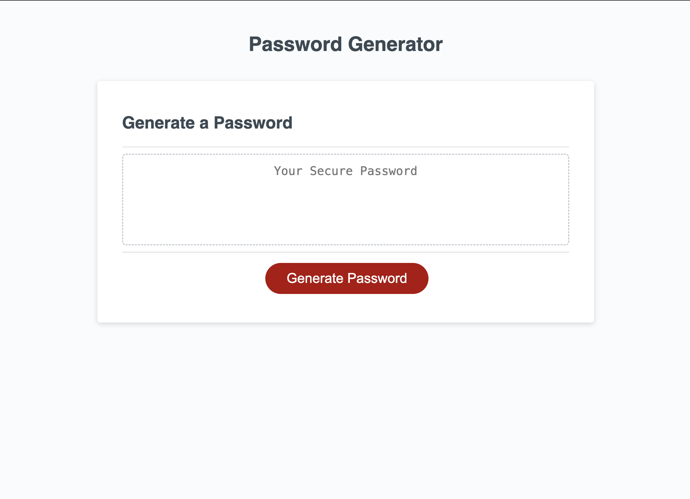
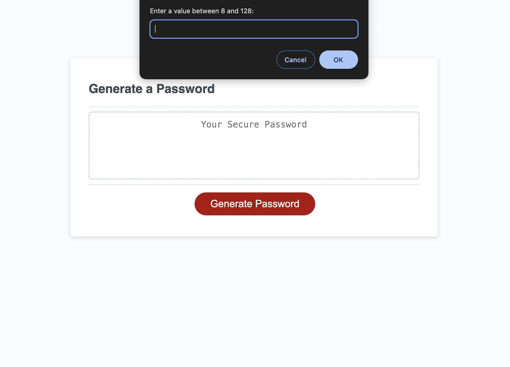
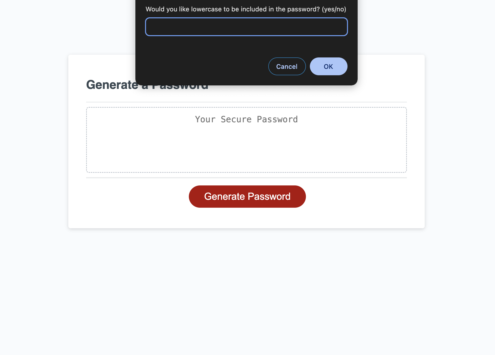
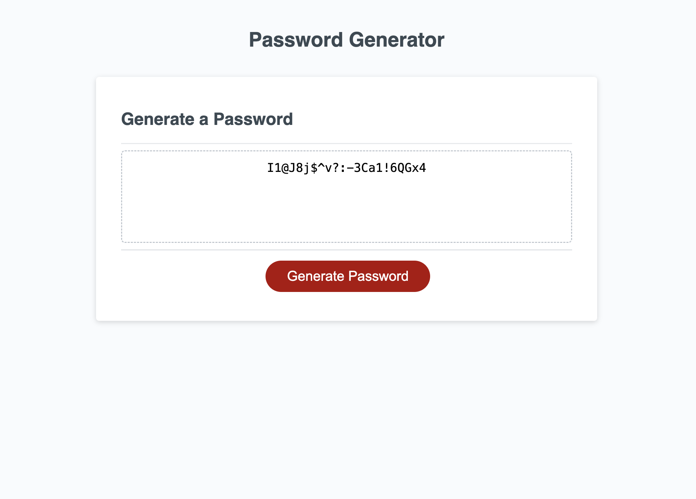

# Password-Generator

## Description

A password generator application in which user can generate a random password based on criteria they are prompted.

## Pseudocode

- When the button is clicked
  - Prompt for password criteria
    - Length of password (between 8 and 128)
    - Character types (at least one to be selected)
      - Lowercase
      - Uppercase
      - Numeric
      - Special characters
  - Generate a password and write to the page

## Screenshots

- Landing screen:

  

- Prompting user for the length of the password limited between 8 and 128:

  

- Prompting user to choose character types:

  

- Generated password is written to the page:

  

## Links

- Live Site URL: [Password Generator](https://fuadeyuboglu.github.io/Password-Generator/)

## License

Licensed under the MIT license.
